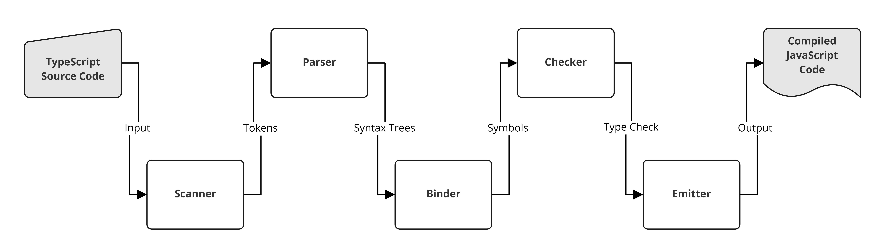

# INFO 443 Project 2 -- TypeScript

<figure>
<figcaption align="center"> <b>The Logo of TypeScript</b> </figcaption>

<figcaption align="center"> <b>Figure 1: The Logo of TypeScript</b> </figcaption>
</figure>

## Project Overview
### Introduction
#### About the Codebase
The codebase we examine in this project is TypeScript, a programming language that builds on JavaScript by adding natural syntax for type specifications to data and adding compiler functionality. Developers can use TypeScript to create their own applications, either client- or server-side.

**In this project, we will only focus on the compiler portion of the TypeScript codebase.**

Fun Facts:
<ul>
<li>TypeScript is a recursive language, so it writes itself.

<li>TypeScript is 11 years old, and has been rewritten twice.
</ul>

#### Authors/Maintainers

This software was developed by Microsoft (a large company) and is currently maintained by the company's employees (628 contributors). Additionally, contributions are accepted when following Microsoft's Code of Conduct, and a number of people appear to be in charge of approving these commits.
- Frequent Contributors:
[@ahejlsberg](https://github.com/ahejlsberg), [@sheetalkamat](https://github.com/sheetalkamat), [@sandersn](https://github.com/sandersn), [@andy-ms](https://github.com/andy-ms), & [@DanielRosenwasser](https://github.com/DanielRosenwasser)

### Learn more about the system

[Official Github](https://github.com/microsoft/TypeScript) |
[Official Documentations](https://www.typescriptlang.org/) |
[Basic Syntax](https://learnxinyminutes.com/docs/typescript/#:~:text=TypeScript%20is%20a%20language%20that,scale%20applications%20written%20in%20JavaScript.&text=It%20is%20a%20superset%20of,The%20TypeScript%20compiler%20emits%20JavaScript) |
[Compiler Details](https://www.youtube.com/watch?v=X8k_4tZ16qU)

### Team Members

INFO 443 project authors: Alex Gherman, Henry Bao, Lisi Case, & Patrick Cheng

## Development View

### Components
Quick overview of the compilation process[^1].
<details>
The process starts with preprocessing.
The preprocessor figures out what files should be included in the compilation by following references (`/// <reference path=... />` tags, `require` and `import` statements).

The parser then generates AST `Node`s.
These are just an abstract representation of the user input in a tree format.
A `SourceFile` object represents an AST for a given file with some additional information like the file name and source text.

The binder then passes over the AST nodes and generates and binds `Symbol`s.
One `Symbol` is created for each named entity.
There is a subtle distinction but several declaration nodes can name the same entity.
That means that sometimes different `Node`s will have the same `Symbol`, and each `Symbol` keeps track of its declaration `Node`s.
For example, a `class` and a `namespace` with the same name can *merge* and will have the same `Symbol`.
The binder also handles scopes and makes sure that each `Symbol` is created in the correct enclosing scope.

Generating a `SourceFile` (along with its `Symbol`s) is done through calling the `createSourceFile` API.

So far, `Symbol`s represent named entities as seen within a single file, but several declarations can merge multiple files, so the next step is to build a global view of all files in the compilation  by building a `Program`.

A `Program` is a collection of `SourceFile`s and a set of `CompilerOptions`.
A `Program` is created by calling the `createProgram` API.

From a `Program` instance a `TypeChecker` can be created.
`TypeChecker` is the core of the TypeScript type system.
It is the part responsible for figuring out relationships between `Symbols` from different files, assigning `Type`s to `Symbol`s, and generating any semantic `Diagnostic`s (i.e. errors).

The first thing a `TypeChecker` will do is to consolidate all the `Symbol`s from different `SourceFile`s into a single view, and build a single Symbol Table by "merging" any common `Symbol`s (e.g. `namespace`s spanning multiple files).  

After initializing the original state, the `TypeChecker` is ready to answer any questions about the program.
Such "questions" might be:
* What is the `Symbol` for this `Node`?
* What is the `Type` of this `Symbol`?
* What `Symbol`s are visible in this portion of the AST?
* What are the available `Signature`s for a function declaration?
* What errors should be reported for a file?

The `TypeChecker` computes everything lazily; it only "resolves" the necessary information to answer a question.
The checker will only examine `Node`s/`Symbol`s/`Type`s that contribute to the question at hand and will not attempt to examine additional entities.

An `Emitter` can also be created from a given `Program`.
The `Emitter` is responsible for generating the desired output for a given `SourceFile`; this includes `.js`, `.jsx`, `.d.ts`, and `.js.map` outputs.
</details>

### Table of the main components of TypeScript Compiler

|Component |Role & Relationship|Description|
|--|--|--|
|Program.ts|Core Compiler|<ul><li>Initializes and runs the necessary files involved in the compiler</li></ul>|
|Parser.ts|Crates a syntax tree<br>Depends on: Scanner|<ul><li>Makes tokens from scanner into a tree with more meaning <li> Knows when the right JavaScript is in the wrong context</ul>|
|Scanner.ts|Internally used and created by Parser|<ul><li>Converts text into syntax tokens <li> Knows only if the JavaScript itself is wrong</ul>|
|Checker.ts|Checks the syntax tree<br>Depends on: Binder|<ul><li>Provides most of the compiler diagnostics<li>Checks each part of syntax tree's node</ul>|
|Binder.ts|Internally used by Checker|<ul><li>Turns syntax into symbols<li>Sets up flow containers based on code scope with flow conditionals within<li>Sees a full syntax tree</ul>|
|Emitter.ts|Creates files<br>Depends on: Transformer|<ul><li>Takes a syntax tree and turns it into a file/files<li>Prints the tree into .js, .ts, and other file types</ul>|
|Transformer.ts|Used by Emitter|<ul><li>Takes a syntax tree and transforms it in various ways to match TypeScript configurations</ul>|


### System Organization Diagram


#### Dependencies

|Other Libraries| Version|
|--|--|
|node|latest|
|azure-devops-node-api |11.0.1|
|browserify|1.11.2|
|eslint|7.12.1|
|gulp|4.0.0|
|typescipt|4.5.5|

For full dependencies, see "Details" below:
<details>
    <pre>
    "@octokit/rest": "latest",
    "@types/browserify": "latest",
    "@types/chai": "latest",
    "@types/convert-source-map": "latest",
    "@types/glob": "latest",
    "@types/gulp": "^4.0.9",
    "@types/gulp-concat": "latest",
    "@types/gulp-newer": "latest",
    "@types/gulp-rename": "0.0.33",
    "@types/gulp-sourcemaps": "0.0.32",
    "@types/jake": "latest",
    "@types/merge2": "latest",
    "@types/microsoft__typescript-etw": "latest",
    "@types/minimatch": "latest",
    "@types/minimist": "latest",
    "@types/mkdirp": "latest",
    "@types/mocha": "latest",
    "@types/ms": "latest",
    "@types/node": "latest",
    "@types/node-fetch": "^2.3.4",
    "@types/q": "latest",
    "@types/source-map-support": "latest",
    "@types/through2": "latest",
    "@types/xml2js": "^0.4.0",
    "@typescript-eslint/eslint-plugin": "^4.28.0",
    "@typescript-eslint/experimental-utils": "^4.28.0",
    "@typescript-eslint/parser": "^4.28.0",
    "async": "latest",
    "azure-devops-node-api": "^11.0.1",
    "browser-resolve": "^1.11.2",
    "browserify": "latest",
    "chai": "latest",
    "chalk": "^4.1.2",
    "convert-source-map": "latest",
    "del": "5.1.0",
    "diff": "^4.0.2",
    "eslint": "7.12.1",
    "eslint-formatter-autolinkable-stylish": "1.1.4",
    "eslint-plugin-import": "2.22.1",
    "eslint-plugin-jsdoc": "30.7.6",
    "eslint-plugin-no-null": "1.0.2",
    "fancy-log": "latest",
    "fs-extra": "^9.0.0",
    "glob": "latest",
    "gulp": "^4.0.0",
    "gulp-concat": "latest",
    "gulp-insert": "latest",
    "gulp-newer": "latest",
    "gulp-rename": "latest",
    "gulp-sourcemaps": "latest",
    "merge2": "latest",
    "minimist": "latest",
    "mkdirp": "latest",
    "mocha": "latest",
    "mocha-fivemat-progress-reporter": "latest",
    "ms": "^2.1.3",
    "node-fetch": "^2.6.1",
    "plugin-error": "latest",
    "pretty-hrtime": "^1.0.3",
    "prex": "^0.4.3",
    "q": "latest",
    "source-map-support": "latest",
    "through2": "latest",
    "typescript": "^4.5.5",
    "vinyl": "latest",
    "vinyl-sourcemaps-apply": "latest",
    "xml2js": "^0.4.19"
    </pre>
</details>


<br>

|Components|Dependencies|
|--|--|
|program.ts|types.ts|
|parser.ts|types.ts, scanner.ts|
|scanner.ts|types.ts|
|checker.ts|types.ts|
|binder.ts|types.ts|
|emitter.ts|types.ts|
|transformer.ts|types.ts|


### Source Code Structure (Codeline Model)


### Testing & Configuration

Tests can be run manually from the TypeScript directory using Gulp tools after installing some dependencies.

#### Directory

Change to the TypeScript directory:

```bash
cd TypeScript
```

#### Dependencies

Install [Gulp](https://gulpjs.com/) tools and dev dependencies:

```bash
npm install -g gulp
npm ci
````

#### Tests

Run tests for the compiler using the following command:

```
gulp runtests --runner=<compiler>        # Run tests for the compiler suite.
```

Additional commands to run tests of your choice and record results are as follows:

```
gulp tests                               # Build the test infrastructure using the built compiler.
gulp runtests                            # Run tests using the built compiler and test infrastructure.
gulp runtests --runner=<runnerName>      # Run tests for a specific suite (e.g., conformance, compiler, fourslash, project, user, and docker).
                                         # Note: You'll need to have the docker executable in your system path for the docker runner to work,
                                         # although we are not focusing on docker at the moment.
gulp runtests --tests=<testPath>         # Run a specific test.
gulp runtests-parallel                   # Like runtests, but split across multiple threads. Uses a number of threads equal to the system
                                         # core count by default. Use --workers=<number> to adjust this.
gulp baseline-accept                     # Replace the baseline test results with the results obtained from gulp runtests.
```

## Applied Perspective: Evolution
### Perspective Introduction
From the evolution perspective, we are considering the ability of the system to be flexible in the face of inevitable change after deployment, and if this is balanced against the costs of providing such flexibility. The term evolution means the process of dealing with all of the possible types of changes in the system development life cycle. Thus, this perspective is relevant to most large-scale information systems.

### Concerns

#### Dimensions of Change
Evolution in the context of TypeScript has to take into account several dimensions of change, considering that TypeScript is intended to be a system that is flexible and accepts changes through contributions and even entire rewrites. Functional evolution is a big dimension of change that needs to be considered, as with TypeScript constantly evolving and filling in gaps, functionality of the system and the subsystems it employs must be adaptable. Another important facet to consider is integration evolution. TypeScript must remain compatible with all the systems it interacts with, as well as writes to, such as JavaScript. As JavaScript-related systems evolve, TypeScript has to evolve with them, which can result in pressures put on the system.


#### Changes Driven by External Factors
Because TypeScript is built on JavaScript, it has to stay up to date with any updates that JavaScript makes to be consistent.

TypeScript is a superset of JavaScript, where any JavaScript is also TypeScript, and the compiler layer in particular compiles TypeScript into JavaScript. When additional features get added to JavaScript—in the form of ECMAScript standards—the TypeScript compiler needs to be able to understand code using these updates in order accurately verify said code. In fact, tests are built into TypeScript to make sure it conform to these standards. This way, it's clear when TS needs to be modified so that users can continue using all the new functionality. ([Source](https://delftswa.gitbooks.io/desosa2018/content/typescript/chapter.html#4-development-view))

Staying up to date is important not only from the perspective of supporting users, but also from a business perspective. Although TypeScript is not for profit, Microsoft would presumably like to retain a wide market of users and be connected to a larger community of developers. Supporting new functionality from JavaScript helps TypeScript stay on the radar and continue being used.

#### Preservation of Knowledge
If possible, up-to-date preservation of project knowledge such as a platform for communication or documentation is vital for an open-source project like TypeScript. However, this is not an easy task to tackle. A project can allocate only so many resources with a software system that is continuously growing in scope and complexity. In addition, with the nature of open source projects, as contributors come and go, memories would fade. What was known could become unknown. Ultimately, it would cause more time and effort to recover that knowledge. The Preservation of Knowledge might not be a concern for TypeScript yet, but it would be more challenging to carry out once the development state becomes more settled. Thus, TypeScript should have a more robust automated system that records new changes and updates.

### Activities

#### Characterize the Evolution Needs

##### Type: Functional Evolution

Magnitude: Because TypeScript has types, not only does TypeScript support existing functionality from JavaScript with this addition, but types allow TypeScript to add additional features such as a compiler and other features related to error detection.

Likelihood: Most of the stand-alone functionality for the compiler has been implemented, so future updates are likely to be small.

Timescale: These updates are not specific, but rather vague needs for changes sometime in the future depending on how techniques and algorithms for identifying and handling errors develop (as well as the second type of evolution described below).

##### Type: Integration Evolution

Magnitude: Since TypeScript is a superset of JavaScript, any JavaScript program is a valid TypeScript, and TypeScript must therefore have implementations to understand and support all of JavaScript. Additionally, it supports JavaScript frameworks such as React.

Likelihood: Because JavaScript is still regularly being developed, TypeScript will continue to be developed as well.

Timescale: These updates, while not necessarily specified in advance, appear on a short time frame multiple times a year, dependent on when JavaScript makes its own updates.

#### Assess Ease of Evolution

##### Assessing Functional Evolution

Looking to TypeScript's history of evolution, as well as considering the robust functionality that has already been implemented into TypeScript as a language, the changes required to accomplish additional functionality would likely be fairly risk-free and time/cost-friendly. As an open-source project managed by Microsoft, this aspect of TypeScript's evolution is well accounted for. This can be seen in TypeScript's incremental updates which have occurred every couple of months since it's 1.0 release version in 2014. The functional changes occurring more recently have been described as system improvements and more specified increases in functionality. This indicates that future changes will likely be similarly specific, small, and unobtrusive.

##### Assessing Integration Evolution:

Integration within TypeScript is a more high-risk point of evolution needs due to the dependence on JavaScript updates. As JavaScript evolves, TypeScript naturally cannot evolve until updates have already been released. This type of integration relationship leaves the door open for there being a period of time when JavaScript has updated more significantly while TypeScript has not yet made the changes necessary to support the changes, leading to errors in TypeScript's functionality. However, in terms of assessing risk versus a need for evolution, this type of improvement that occurs out of necessity for filling in the gaps between JavaScript and TypeScript updates, this is a needed risk to assume in order to maintain the core functionality of the program.

## Styles & Patterns Used

### Architectural Style
The goal of the TypeScript compiler is to transform a series of `.js`, `.ts`, `.json`, and `.d.ts` files into `.js`, `.d.ts`, and `.js.map` files accordingly. To abstract this process in a higher-level sense, the compiler takes the sources files through a sequential linear process that incorporates the **Pipe & Filter** Architectural style. 

The TypeScript compiler can be generalized into 6 different operations:
|Name|Operation|
|--|--|
|Scanner|Reads text from left to right and creates syntax tokens|
|Parser|Examines tokens from the scanner and creates syntax trees accordingly|
|Binder|Cycles through syntax trees and links symbols|
|Checker|Compares symbols across all syntax trees and gives diagnostics|
|Emitter|Takes syntax trees and emits `.js`, `.d.ts` files|



### Software Design Patterns
|Name|Context| Problem | Solution |
|--|--|--|--|
|Adapter|`src/compiler/transformer.ts`|TypeScript needs to be able to emit files in various compatible formats, like Javascript, for example. The syntax trees created by TypeScript are compatible with TypeScript, not other languages that a user may want to emit a file to, so the syntax tree must be altered before being passed onto the Emitter.|The transformer uses the adapter pattern to transform a TypeScript-compatible syntax tree into a Javascript-compatible syntax tree, which can then be further utilized by the user through whatever means they would like to. The Adapter is a pattern that allows incompatible interfaces to collaborate, and as such, the transformer acts as an Adapter from Typescript to other languages.|
|Abstract Factory|`BaseNodeFactory` in `src/compiler/factory/baseNodeFactory.ts`|TypeScript needs to able to create a syntax tree for parsing JavaScript, which is composed of nodes of a variety of predefined types representing different parts of syntax.|To abstract out this creation, TypeScript uses a `BaseNodeFactory` to abstract out creating a group of nodes. This way, clients of this class don't need to worry about the nitty-gritty details of all of the `ObjectAllocator`'s `Node` constructors and can create instances of nodes more simply and within a shared context.|
|Builder|`builder.ts`, `builderPublic.ts`, `builderState.ts`, and `builderStatePublic.ts` in  `src/compiler/`|TypeScript needs to create different complex objects for a variety of tasks, such as managing program state changes, creating diagnostic functions and watch functions. These complex objects all have the same construction process.|The builder files provides the other components a large number of builder interfaces to unify and simplify the complex object creating process. Allowing clients to create different complex objects using the same construction process.|
|Visitor|`NodeVisitor` in `src/compiler/types.ts`|In TypeScript, each node represents a fundamental building block. These nodes need to be identified and transformed in a flexible manner when it comes to adding new behaviors to existing functionalities without violating the Single Responsibility Principle.|The visitor interface declares a set of visiting methods that correspond to the accepted node that is passed in. The functions will then process and possibly transforms the node. This pattern permits nodes to be operating without figuring out their concrete classes.|

## Architectural Assessment
|Principle| Definition | Examples | Discussion|
|--|--|--|--|
| Single Responsibility Principle| An element should be responsible to one and only one actor. | The parser component is used to build syntax trees. In `parser.ts`, there are many functions that are each responsible for a small step of the syntax tree building process. For example, the function `findHighestListElementThatStartsAtPosition` at line 9230  | Lots of complex functionality is regularly broken down into small steps. As evident in the provided examples, methods are designed to accomplish very specific and narrow tasks. |
| Open-Closed Principle | Elements should be open for extension but closed for modification. | Function “parseTag” in parser.ts | The "parseTag" function violates the open-closed principle as it contains several specific functions for certain tags rather than abstracting these functions to a higher level. If a new type needed to be accommodated, this would require modification of existing code. |
| Interface Segregation Principle | Clients should not be forced to implement interfaces they do not use. Interfaces should not have methods that it doesn’t need. | <ol><li>`type.ts` - property `hasTrailingComma` in two interfaces at line 1009 ~ 1014: `MutableNodeArray` and `NodeArray`<li>`type.ts` property `autoGenerateFlags` at line 1125 - `Identifier` interface, and at line 1147 `GeneratedIdentifier` interface</ol> | The TypeScript codebase uses interface variations to offer reduced/additional functionality for property modification. In the first given example, there are two specific node arrays that allow clients to focus on specialized functionality that fit their specific needs. Rather than being forced to use a mutable node array if the array hasTrailingComma property will never be changed, a client can use a NodeArray interface instead, where that property is readonly and thus does not have functionality that the client doesn't need. Similarly, in the second example, the autoGenerateFlags property may or may not be a read-only property. This allows a client to be intentional in choosing an interface whose functionality best reflects their goal for an object. |
| Principle of Separation of Concerns | Organize software into separate elements that are as independent as possible  | under`TypeScript/src`:<br><ul><li>`compiler/`<li>`debug/`<li>`server/`<li>`services/`<li>...</ul> <br> under `TypeScript/src/compiler/`: <br> <ul><li>`parser.ts`<li>`scanner.ts`<li>`checker.ts`<li>`binder.ts`<li>`emitter.ts`<li>`transformer.ts`</ul> | The entire TypeScript codebase is broken up into distinct modules, and similar can be said for those modules as well—including for our focus, the compiler. This helps create an architecture that can be analyzed at various levels of detail, significantly assisting with comprehension as well as code organization. |
| Principle of Least Knowledge <br> (Law of Demeter) |  An object should never know the internal details of other objects.| <ol><li>`utilities.ts` line 4887 <br> `getModifierFlagsWorker` returns property of node <li> `binder.ts` line 18 <br> `getModuleInstanceState` returns node.body property <li> `corePublic.ts`<ul><li> line 56: set method for ESMap <li> line 41: get key for ReadonlyESMAP</ul></ol> | Throughout the codebase, getter and setter methods are used to allow clients to interact with the properties of a class or other object indirectly. This helps with encapsulation and abstraction, making sure that other objects don't have access to the internal details of a given object. |

## System Improvement


## Foot Notes
[^1]: [TypeScript Compiler Notes by Microsoft](https://github.com/microsoft/TypeScript-Compiler-Notes)
